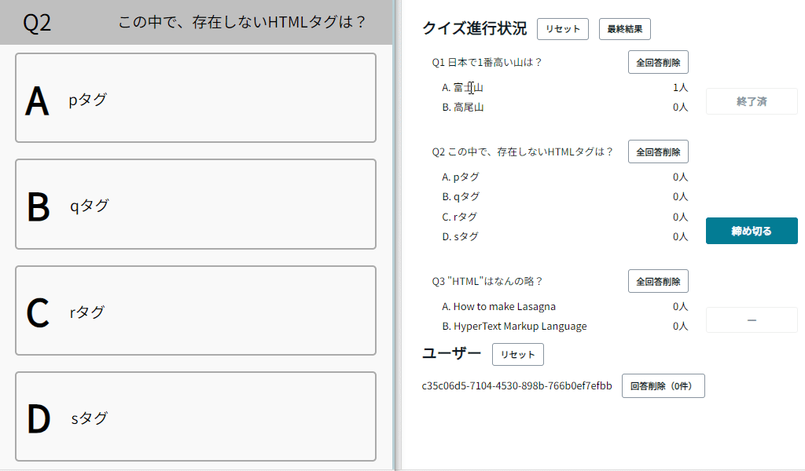

## Amplify Quiz App

AWS Amplify (Gen2)を使ったクイズアプリの実装です。

会社でのミニ勉強会の機会に、Amplifyのキャッチアップを兼ねて30～40時間程度で製作しました。

## 機能

クイズの参加者は次のことができます。

- Amplifyアプリ(`/`)を開いて、クイズに参加します
    - 管理者がクイズを開始するまでは、待機画面が表示されます
    - クイズが開始されると、問題文と選択肢が表示され、選択できます
    - 管理者が正解発表すると、回答の正誤が表示されます

クイズの管理者は次のことができます

- 管理画面(`/admin`)にアクセスできます
    - クイズの進行（回答受付の開始・終了・正解発表）を管理します
    - 各ユーザー・各問題における回答を削除できます
- 編集画面(`/edit`)にアクセスできます
    - クイズの問題と選択肢を編集できます

## 仕様

短時間で実装したかったので、必要そうないろんな機能を省いたミニマムなアプリになっています。

- データの取得がサンプルコードのままなので、効率が悪くなっています
- データの認証・認可を省いているので、参加者がマスターデータを読み書きしたり、他の参加者の回答を消したりできます
- 裏技があった方が面白いので、GraphQLのレスポンスを覗くと答えが分かる仕様になっています
- アクセスできた方が面白いので、管理画面に認証を実装していません
- ルーム機能（複数のクイズ大会の同時開催）などの豪華な仕様もありません

## 開発・デプロイ方法

https://docs.amplify.aws/react/start/quickstart/
